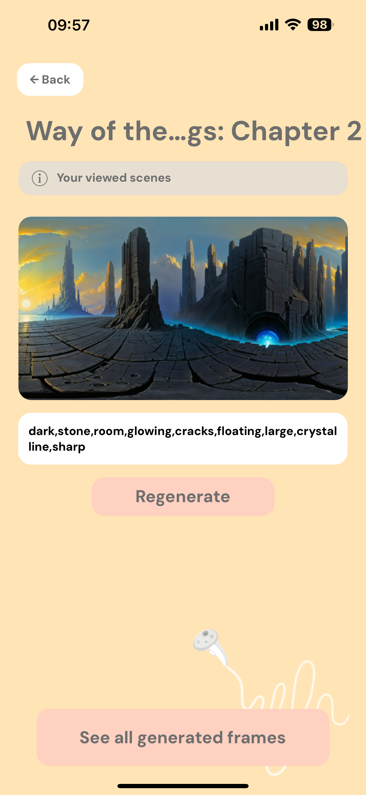
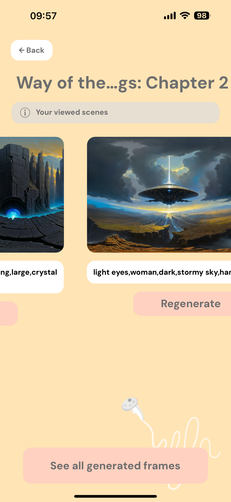
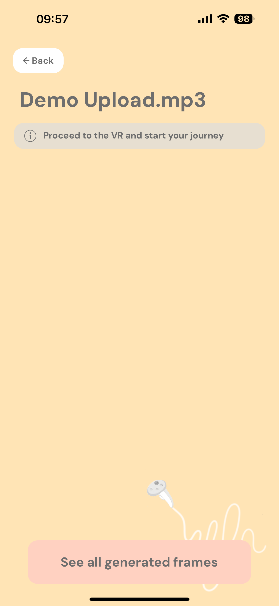
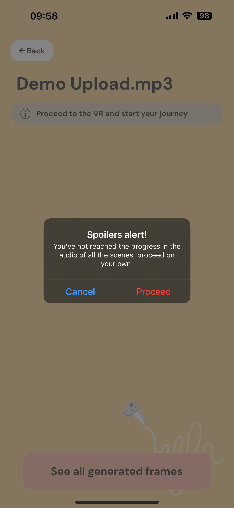
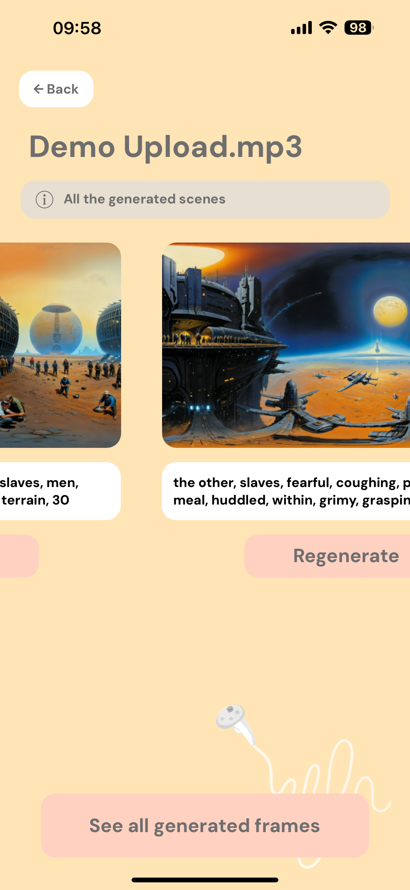
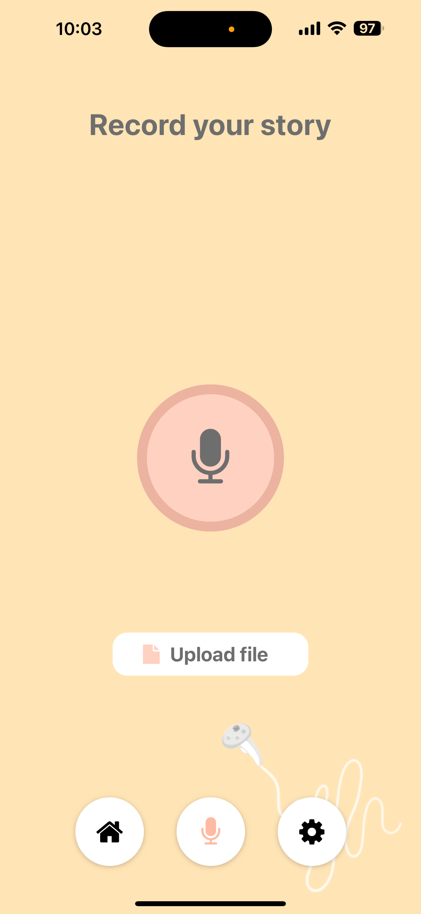
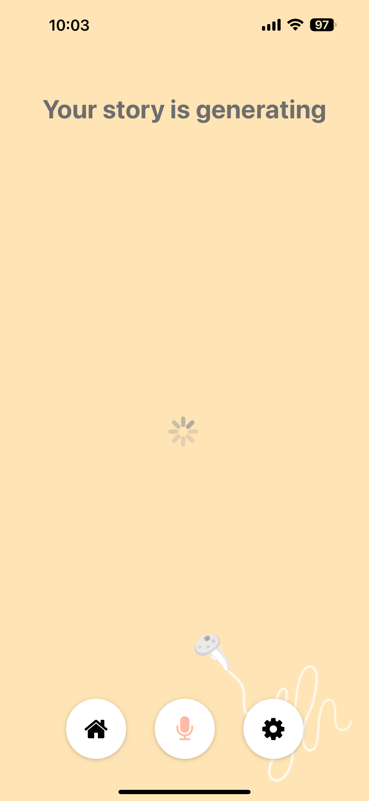

# VaudioR

> ### Hearing a story is cool, but being part of it is awesome.

### Auth Stack

> You can use the app simple and effective by creating an account or using an already created one.

  
  

### Your stories, our prority

> On the home screen you can access all your stories and for each story you can recheck all the viewed scenes.

  
  
  

> If you are not able to see any scenes, don't panic, you did not watch them in the VR app.

  
  
  

### Handle your stories

> You can upload your favourite audiobooks or create your own stories, just select or record them and wait for the magic
> to happen
>

  
  
  

### Settings and instructions

  

